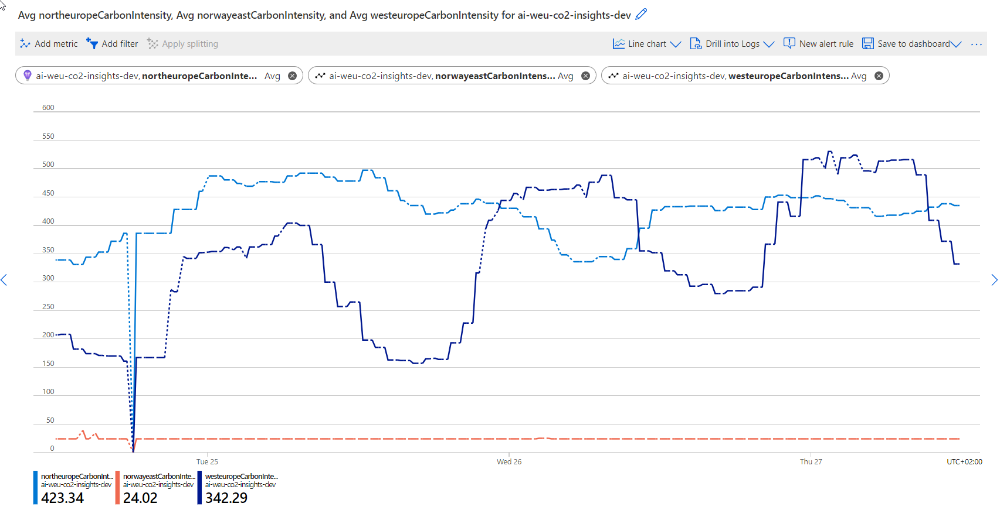

Carbon AppInsights Samples
==========================

This repository contains samples that demonstrate various use cases for the
metrics provided to Azure Application Insights by the
[carbon-appinsights](htts://github.com/cloudyspells/carbon-appinsights) project.

The sample projects are placed in subdirectories of this the `samples` folder.
Each sample comes with it's own `README.md` file that explains the use case and
how to run the sample.

## Samples

- [Refresh a Power BI dataset when emissions are low](/samples/refresh-pbi-dataset/README.md)
- [Queue an Azure Devops build when emissions are low](/samples/refresh-pbi-dataset/README.md)
- [Trigger a GitHub Actions repository dispatch event](/samples/github-repo-dispatch/README.md)
