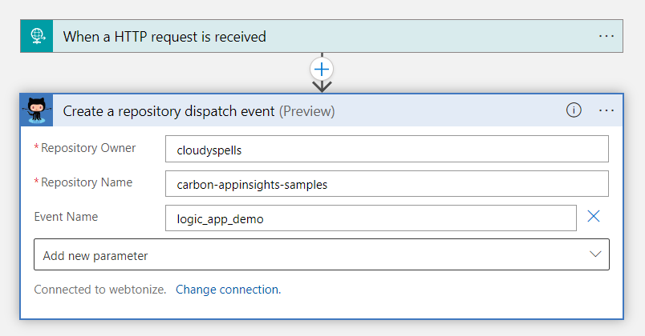

GitHub Repository Dispatch
==========================

Run long builds when emissions drop below a certain threshold.
--------------------------------------------------------------

This sample demonstrates how to use the GitHub Repository Dispatch trigger with
a Logic App triggered by Azure Monitor Metrics when the CO2 emissions in the
choses region drop below a certain threshold.

 

Use Case
--------

The use case for this sample is to run long builds when the CO2 emissions in
the chosen region drop below a certain threshold. This is useful if you want to
run builds that are not time critical when the emissions are low.

The sample uses the 
[carbon-appinsights](https://github.com/cloudyspells/carbon-appinsights) project
to send CO2 emissions metrics to Azure Application Insights. The Logic App is
triggered by a metric alert on the `co2e` metric. The Logic App then checks if
the emissions are below a certain threshold and if so, it triggers a
GitHub Repository Dispatch event to run a GitHub Action workflow.

The sample uses the following Azure resources:

- Azure Monitor Metric Alert
- Azure Logic App
- Azure Logic App Connector for GitHub

Prerequisites
-------------

- An Azure subscription
- A deployment of the
  [carbon-appinsights](https://github.com/cloudyspells/carbon-appinsights) project

Deployment
----------

The sample can be deployed using the Azure CLI. The following command will
deploy the sample. Set up the parameters as described in the
`main.parameters.json` as required for your github environment.

```console
az deployment sub create \
  --location westeurope \
  --template-file main.bicep \
  --parameters @main.parameters.json
```

After the deployment has completed, you need to configure the Logic App to
authenticate with GitHub. To do this, open the Logic App in the Azure Portal
and click on the `GitHub` connector. Then click on `Edit API connection` and
follow the instructions to authenticate with GitHub.

see the `.github/workflows/qa-psrule.yml` workflow for an example of how to
trigger a GitHub Action workflow from a GitHub Repository Dispatch event for this
sample.
