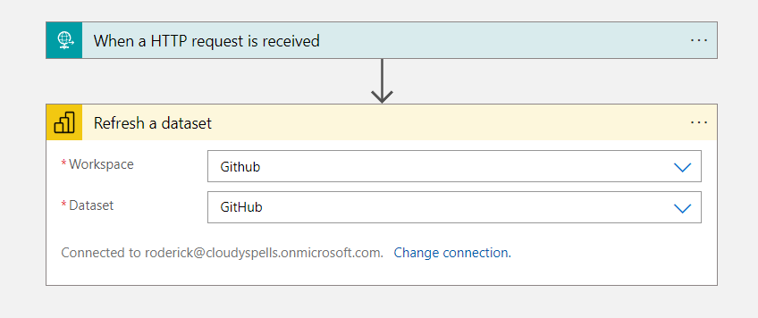

Refresh Power BI dataset
========================

## Summary

This sample shows how to refresh a Power BI with an Azure Logic App triggered
by a metric alert from Azure Application Insights as logged by
[carbon-appinsights](https://github.com/cloudyspells/carbon-appinsights).
The metric alert is triggered when carbon emissions in the region of the
Power BI dataset are below a certain threshold.



## Usage

This sample, like all others, requires the _carbon-appinsights_ solution deployed
for at least 1 monitored region.

To use this sample you will need the _Group ID_ and _Dataset ID_ of a dataset to
refresh in Power BI. You can get these from the Power BI portal by selecting
app and then select the dataset properties from the menu. The Group ID and
Dataset ID will be in the resulting URL.

Fill in the parameters in the `main.parameters.json` file to your situation. The
following table displays their purpose.

|Parameter|Purpose|
|---------|-------|
|`location`|Location / Azure region for the deployment|
|`environment`|Lifecycle environment used in name convention, eg: `dev` or `prd`|
|`alertRuleScope`|_Resource ID_ of the _Application Insights_ instance with the `carbon-appinsights` metrics.|
|`alertRuleRegion`|Azure region monitored by the `carbon-appinsights` metric.|
|`lowEmissionTriggerThreshold`|Threshold below which the alert is triggered in gr/KWh.|
|`projectName`|Name used in name convention for resourcegroup|
|`pbiUsername`|User Principal Name of the user to connect to the Power BI dataset|
|`pbiGroupId`|_Group ID_ of the Power BI dataset to refresh|
|`pbiDataSetId`|_Dataset ID_ of the Power BI dataset to refresh|

You can then run the deployment with _azure-cli_ from the command line:

```console
az deployment sub create -f main.bicep \
    --parameters @main.parameters.json \
    --location westeurope
```

After running the deployment you will need to manually authenticate the created
powerbi _Api connection_ resource in the Azure portal.
